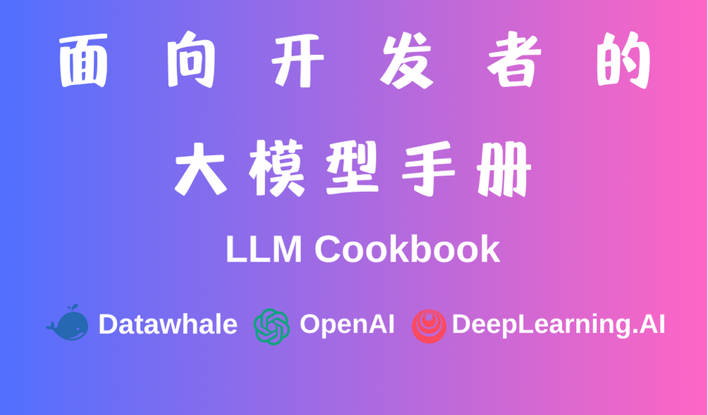

# 面向开发者的大模型手册 - LLM Cookbook

## 项目简介

本项目是一个面向开发者的大模型手册，针对国内开发者的实际需求，主打 LLM 全方位入门实践。本项目基于吴恩达老师大模型系列课程内容，对原课程内容进行筛选、翻译、复现和调优，覆盖从 Prompt Engineering 到 RAG 开发、模型微调的全部流程，用最适合国内学习者的方式，指导国内开发者如何学习、入门 LLM 相关项目。

针对不同内容的特点，我们对共计 11 门吴恩达老师的大模型课程进行了翻译复现，并结合国内学习者的实际情况，对不同课程进行了分级和排序，初学者可以先系统学习我们的必修类课程，掌握入门 LLM 所有方向都需要掌握的基础技能和概念，再选择性地学习我们的选修类课程，在自己感兴趣的方向上不断探索和学习。

如果有你非常喜欢但我们还没有进行复现的吴恩达老师大模型课程，我们欢迎每一位开发者参考我们已有课程的格式和写法来对课程进行复现并提交 PR，在 PR 审核通过后，我们会根据课程内容将课程进行分级合并。欢迎每一位开发者的贡献！

**在线阅读地址：[面向开发者的 LLM 入门课程-在线阅读](https://datawhalechina.github.io/llm-cookbook/)**

**PDF下载地址：[面向开发者的 LLM 入门教程-PDF](https://github.com/datawhalechina/llm-cookbook/releases/tag/v1%2C0%2C0)**

**英文原版地址：[吴恩达关于大模型的系列课程](https://learn.deeplearning.ai)**

## 项目意义

LLM 正在逐步改变人们的生活，而对于开发者，如何基于 LLM 提供的 API 快速、便捷地开发一些具备更强能力、集成LLM 的应用，来便捷地实现一些更新颖、更实用的能力，是一个急需学习的重要能力。

由吴恩达老师与 OpenAI 合作推出的大模型系列教程，从大模型时代开发者的基础技能出发，深入浅出地介绍了如何基于大模型 API、LangChain 架构快速开发结合大模型强大能力的应用。其中，《Prompt Engineering for Developers》教程面向入门 LLM 的开发者，深入浅出地介绍了对于开发者，如何构造 Prompt 并基于 OpenAI 提供的 API 实现包括总结、推断、转换等多种常用功能，是入门 LLM 开发的经典教程；《Building Systems with the ChatGPT API》教程面向想要基于 LLM 开发应用程序的开发者，简洁有效而又系统全面地介绍了如何基于 ChatGPT API 打造完整的对话系统；《LangChain for LLM Application Development》教程结合经典大模型开源框架 LangChain，介绍了如何基于 LangChain 框架开发具备实用功能、能力全面的应用程序，《LangChain Chat With Your Data》教程则在此基础上进一步介绍了如何使用 LangChain 架构结合个人私有数据开发个性化大模型应用；《Building Generative AI Applications with Gradio》、《Evaluating and Debugging Generative AI》教程分别介绍了两个实用工具 Gradio 与 W&B，指导开发者如何结合这两个工具来打造、评估生成式 AI 应用。

上述教程非常适用于开发者学习以开启基于 LLM 实际搭建应用程序之路。因此，我们将该系列课程翻译为中文，并复现其范例代码，也为其中一个视频增加了中文字幕，支持国内中文学习者直接使用，以帮助中文学习者更好地学习 LLM 开发；我们也同时实现了效果大致相当的中文 Prompt，支持学习者感受中文语境下 LLM 的学习使用，对比掌握多语言语境下的 Prompt 设计与 LLM 开发。未来，我们也将加入更多 Prompt 高级技巧，以丰富本课程内容，帮助开发者掌握更多、更巧妙的 Prompt 技能。

## 项目受众

所有具备基础 Python 能力，想要入门 LLM 的开发者。

## 项目亮点

《ChatGPT Prompt Engineering for Developers》、《Building Systems with the ChatGPT API》等教程作为由吴恩达老师与 OpenAI 联合推出的官方教程，在可预见的未来会成为 LLM 的重要入门教程，但是目前还只支持英文版且国内访问受限，打造中文版且国内流畅访问的教程具有重要意义；同时，GPT 对中文、英文具有不同的理解能力，本教程在多次对比、实验之后确定了效果大致相当的中文 Prompt，支持学习者研究如何提升 ChatGPT 在中文语境下的理解与生成能力。

## 学习指南

本教程适用于所有具备基础 Python 能力，想要入门 LLM 的开发者。

如果你想要开始学习本教程，你需要提前具备：

1. 至少一个 LLM API（最好是 OpenAI，如果是其他 API，你可能需要参考[其他教程](https://github.com/datawhalechina/llm-universe)对 API 调用代码进行修改）
2. 能够使用 Python Jupyter Notebook 

本教程共包括 11 门课程，分为必修类、选修类两个类别。必修类课程是我们认为最适合初学者学习以入门 LLM 的课程，包括了入门 LLM 所有方向都需要掌握的基础技能和概念，我们也针对必修类课程制作了适合阅读的在线阅读和 PDF 版本，在学习必修类课程时，我们建议学习者按照我们列出的顺序进行学习；选修类课程是在必修类课程上的拓展延伸，包括了 RAG 开发、模型微调、模型评估等多个方面，适合学习者在掌握了必修类课程之后选择自己感兴趣的方向和课程进行学习。

必修类课程包括：

1. 面向开发者的 Prompt Engineering。基于吴恩达老师《ChatGPT Prompt Engineering for Developers》课程打造，面向入门 LLM 的开发者，深入浅出地介绍了对于开发者，如何构造 Prompt 并基于 OpenAI 提供的 API 实现包括总结、推断、转换等多种常用功能，是入门 LLM 开发的第一步。
2. 搭建基于 ChatGPT 的问答系统。基于吴恩达老师《Building Systems with the ChatGPT API》课程打造，指导开发者如何基于 ChatGPT 提供的 API 开发一个完整的、全面的智能问答系统。通过代码实践，实现了基于 ChatGPT 开发问答系统的全流程，介绍了基于大模型开发的新范式，是大模型开发的实践基础。
3. 使用 LangChain 开发应用程序。基于吴恩达老师《LangChain for LLM Application Development》课程打造，对 LangChain 展开深入介绍，帮助学习者了解如何使用 LangChain，并基于 LangChain 开发完整的、具备强大能力的应用程序。
4. 使用 LangChain 访问个人数据。基于吴恩达老师《LangChain Chat with Your Data》课程打造，深入拓展 LangChain 提供的个人数据访问能力，指导开发者如何使用 LangChain 开发能够访问用户个人数据、提供个性化服务的大模型应用。

选修类课程包括：

1. 使用 Gradio 搭建生成式 AI 应用。基于吴恩达老师《Building Generative AI Applications with Gradio》课程打造，指导开发者如何使用 Gradio 通过 Python 接口程序快速、高效地为生成式 AI 构建用户界面。
2. 评估改进生成式 AI。基于吴恩达老师《Evaluating and Debugging Generative AI》课程打造，结合 wandb，提供一套系统化的方法和工具，帮助开发者有效地跟踪和调试生成式 AI 模型。
3. 微调大语言模型。基于吴恩达老师《Finetuning Large Language Model》课程打造，结合 lamini 框架，讲述如何便捷高效地在本地基于个人数据微调开源大语言模型。
4. 大模型与语义检索。基于吴恩达老师《Large Language Models with Semantic Search》课程打造，针对检索增强生成，讲述了多种高级检索技巧以实现更准确、高效的检索增强 LLM 生成效果。
5. 基于 Chroma 的高级检索。基于吴恩达老师《Advanced Retrieval for AI with Chroma》课程打造，旨在介绍基于 Chroma 的高级检索技术，提升检索结果的准确性。
6. 搭建和评估高级 RAG 应用。基于吴恩达老师《Building and Evaluating Advanced RAG Applications》课程打造，介绍构建和实现高质量RAG系统所需的关键技术和评估框架。
7. LangChain 的 Functions、Tools 和 Agents。基于吴恩达老师《Functions, Tools and Agents with LangChain》课程打造，介绍如何基于 LangChain 的新语法构建 Agent。
8. Prompt 高级技巧。包括 CoT、自我一致性等多种 Prompt 高级技巧的基础理论与代码实现。

其他资料包括：

**双语字幕视频地址：[吴恩达 x OpenAI的Prompt Engineering课程专业翻译版](https://www.bilibili.com/video/BV1Bo4y1A7FU/?share_source=copy_web)**

**中英双语字幕下载：[《ChatGPT提示工程》非官方版中英双语字幕](https://github.com/GitHubDaily/ChatGPT-Prompt-Engineering-for-Developers-in-Chinese)**

**视频讲解：[面向开发者的 Prompt Engineering 讲解（数字游民大会）](https://www.bilibili.com/video/BV1PN4y1k7y2/?spm_id_from=333.999.0.0)**

目录结构说明：

    content：基于原课程复现的双语版代码，可运行的 Notebook，更新频率最高，更新速度最快。
    
    docs：必修类课程文字教程版在线阅读源码，适合阅读的 md。
    
    figures：图片文件。

## 致谢

**核心贡献者**

- [邹雨衡-项目负责人](https://github.com/logan-zou)（Datawhale成员-对外经济贸易大学研究生）
- [左春生-项目负责人](https://github.com/LinChentang)（内容创作者-Datawhale成员）
- [长琴-项目发起人](https://yam.gift/)（内容创作者-Datawhale成员-AI算法工程师）
- [玉琳-项目发起人](https://github.com/Sophia-Huang)（内容创作者-Datawhale成员）
- [徐虎-教程编撰者](https://github.com/xuhu0115)（内容创作者-Datawhale成员）
- [刘伟鸿-教程编撰者](https://github.com/Weihong-Liu)（内容创作者-江南大学非全研究生）
- [Joye-教程编撰者](https://Joyenjoye.com)（内容创作者-数据科学家）
- [高立业](https://github.com/0-yy-0)（内容创作者-DataWhale成员-算法工程师）
- [邓宇文](https://github.com/GKDGKD)（内容创作者-Datawhale成员）
- [魂兮](https://github.com/wisdom-pan)（内容创作者-前端工程师）
- [宋志学](https://github.com/KMnO4-zx)（内容创作者-Datawhale成员）
- [韩颐堃](https://github.com/YikunHan42)（内容创作者-Datawhale成员）
- [陈逸涵](https://github.com/6forwater29) (内容创作者-Datawhale意向成员-AI爱好者)
- [仲泰](https://github.com/ztgg0228)（内容创作者-Datawhale成员）
- [万礼行](https://github.com/leason-wan)（内容创作者-视频翻译者）
- [王熠明](https://github.com/Bald0Wang)（内容创作者-Datawhale成员）
- [曾浩龙](https://yetingyun.blog.csdn.net)（内容创作者-Datawhale 意向成员-JLU AI 研究生）
- [小饭同学](https://github.com/xinqi-fan)（内容创作者）
- [孙韩玉](https://github.com/sunhanyu714])（内容创作者-算法量化部署工程师）
- [张银晗](https://github.com/YinHan-Zhang)（内容创作者-Datawhale成员）
- [张晋](https://github.com/Jin-Zhang-Yaoguang)（内容创作者-Datawhale成员）
- [李娇娇](https://github.com/Aphasia0515)（内容创作者-Datawhale成员）
- [邓恺俊](https://github.com/Kedreamix)（内容创作者-Datawhale成员）
- [范致远](https://github.com/Zhiyuan-Fan)（内容创作者-Datawhale成员）
- [周景林](https://github.com/Beyondzjl)（内容创作者-Datawhale成员）
- [诸世纪](https://github.com/very-very-very)（内容创作者-算法工程师）
- [Zhang Yixin](https://github.com/YixinZ-NUS)（内容创作者-IT爱好者）
- Sarai（内容创作者-AI应用爱好者）

**其他**

1. 特别感谢 [@Sm1les](https://github.com/Sm1les)、[@LSGOMYP](https://github.com/LSGOMYP) 对本项目的帮助与支持；
2. 感谢 [GithubDaily](https://github.com/GitHubDaily) 提供的双语字幕；
3. 如果有任何想法可以联系我们 DataWhale 也欢迎大家多多提出 issue；
4. 特别感谢以下为教程做出贡献的同学！

Made with [contrib.rocks](https://contrib.rocks).

## Star History

## 关注我们

扫描下方二维码关注公众号：Datawhale

Datawhale 是一个专注于数据科学与 AI 领域的开源组织，汇集了众多领域院校和知名企业的优秀学习者，聚合了一群有开源精神和探索精神的团队成员。微信搜索公众号Datawhale可以加入我们。

## LICENSE
 本作品采用<a rel="license" href="http://creativecommons.org/licenses/by-nc-sa/4.0/">知识共享署名-非商业性使用-相同方式共享 4.0 国际许可协议</a>进行许可。
