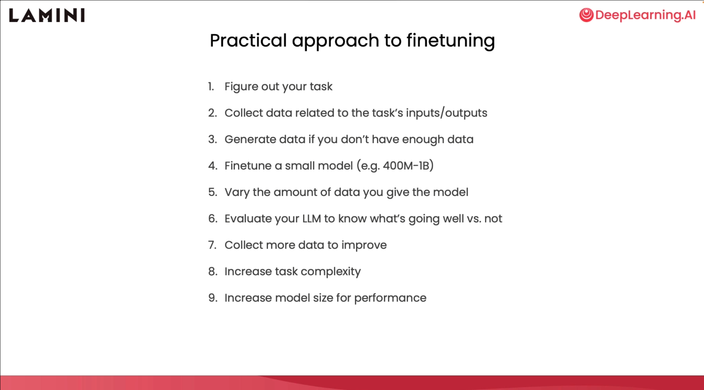
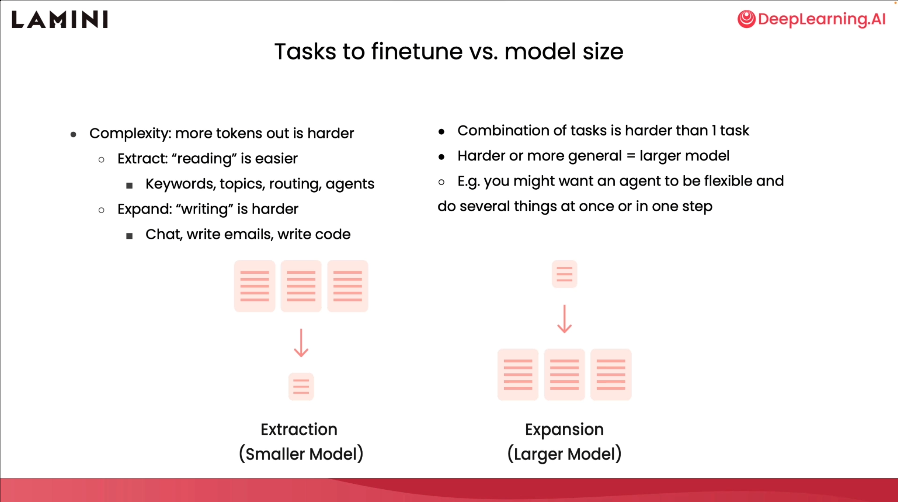
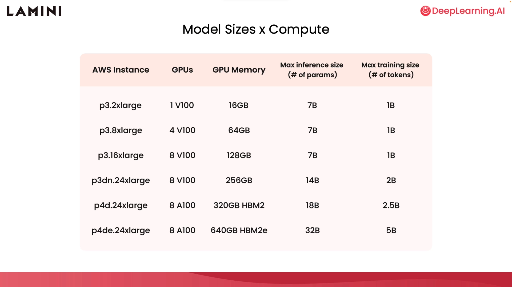
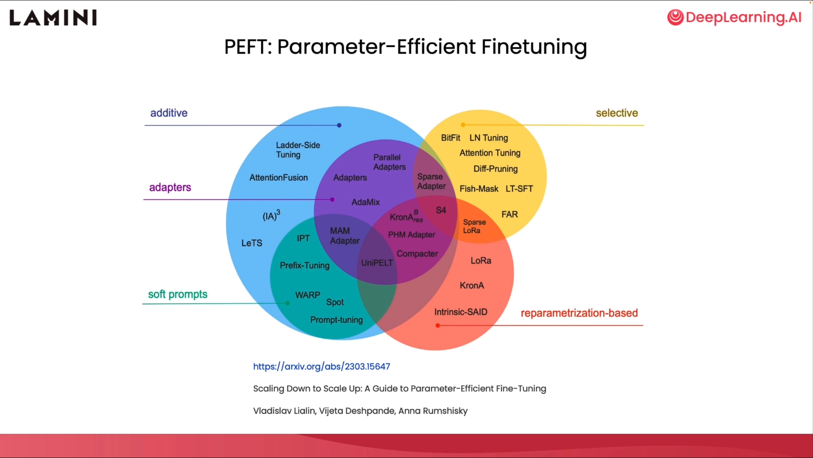
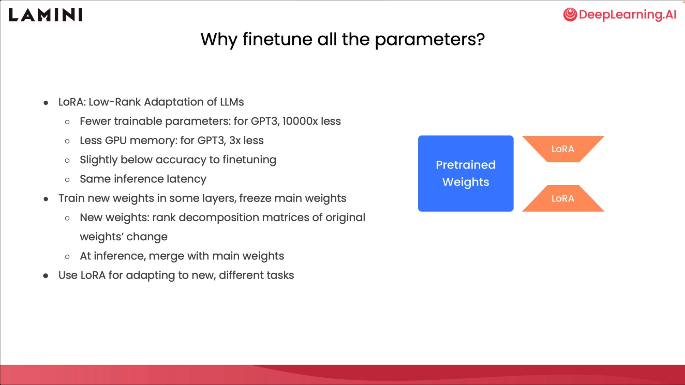

# 第八章 入门注意事项

好的，你已经上了最后一课，下面将为你介绍一些入门的注意事项、一些实用技巧，以及一些更高级的训练方法。

## 微调使用步骤

让我们从一些微调的实用步骤开始。

概括地说，首先，你要弄清自己的任务，收集与任务输入和输出相关的数据，并将其结构化。如果你没有足够的数据，也没有问题，只需生成一些数据或使用提示模板来创建更多数据。起初，你需要微调一个小型模型。我建议使用一个 4 亿到 10 亿参数的模型，以了解该模型的性能如何。你应该改变模型的实际数据量，以了解有多少数据会影响模型的走向。然后，你就可以对模型进行评估，看看哪些地方做得好，哪些地方做得不好。最后，你要收集更多的数据，通过评估来改进模型。

在此基础上，你现在可以增加任务的复杂度，这样就可以让任务变得更难。然后，你还可以增加模型的大小，以提高在更复杂任务上的性能。

## 任务微调

在任务微调方面，你已经了解了阅读任务和写作任务。写作任务要难得多，这些任务的范围更广，比如聊天、写邮件、写代码，这是因为模型会产生更多的token。因此，对模型来说，这是一项更难的任务。更难的任务往往需要更大的模型来处理。

另一种更难的任务是任务组合，要求模型做一系列事情，而不是只做一项任务。这可能意味着让一个agent灵活地同时做几件事，或者只做一步而不是多步。

## 模型大小与计算资源

现在，你对任务复杂度所需的模型大小已经有了一定的了解，基本上也有了运行模型所需的硬件方面的计算要求。

在你之前运行的程序中，你看到了在 CPU 上运行的 7000 万参数模型。它们并不是最好的模型，我建议从性能更好的模型开始。

因此，如果你看到这个表格中的第一行，我想调出一个 v100 GPU，它可以在 [AWS](https://aws.amazon.com/) 上使用，也可以在任何其他云平台上使用。你可以看到它有 16 千兆字节的内存，这意味着它可以运行一个 70 亿参数的模型进行推理。

但对于训练而言，训练需要更多内存来存储梯度和优化器，因此它实际上只能拟合 10 亿个参数模型。如果你想拟合更大的模型，你可以在这里看到一些其他选项。

## 参数高效微调

很好，也许你觉得这还不够，你还想处理更大的模型。有一种方法叫做 [PEFT](https://arxiv.org/abs/2303.15647) 或参数高效微调，它是一套不同的方法，可以帮助你做到这一点。在使用参数和训练模型的过程中效率更高。

我非常喜欢的一种方法是 LORA，它代表低秩自适应。

LORA 的作用在于，它能大量减少需要训练的参数和权重。以 GPT-3 为例，他们发现可以减少 10,000 倍，这使得 GPU 所需的显存减少了 3 倍。虽然微调的准确度略低，但这仍然是一种高效得多的方法，而且最终的推理延迟也是相同的。那么 LORA 究竟是怎么回事呢？实际上，你是在模型的某些层中训练新的权重，同时冻结预先训练好的主要权重。因此，这些权重都被冻结了，然后就有了这些新的橙色权重。这些就是 LORA 权重。新权重有点数学化，是原始权重变化的秩分解矩阵。

但重要的不是数学，而是你可以训练这些权重。重要的是，你可以单独训练这些权重，与预训练的权重交替使用，然后在推理时将它们合并回主要的预训练权重中，从而更高效地获得微调模型。我对 LORA 的使用感到非常兴奋，因为它能适应新的任务。这就意味着，你可以用 LORA 在一个客户的数据上训练一个模型，然后在另一个客户的数据上训练另一个模型，然后在需要时将它们分别合并到推理中。