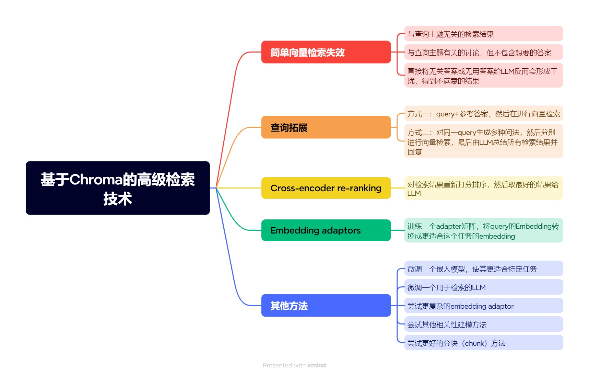

# 7. 其他技术

基于embedding的检索技术仍然是一个非常活跃的研究领域，除了这节课我们学到的几个方案外，还有一些其他方法可以尝试提升检索效果，比如：

- 微调一个embedding模型
- 微调一个用于检索的LLM
- 尝试更复杂的embedding adaptor
- 尝试其他的相关性建模方法
- 尝试更好的分块（chunk）方法

## 课程总结

以上便是我们这节课的全部内容，恭喜你完成了所有的内容！

