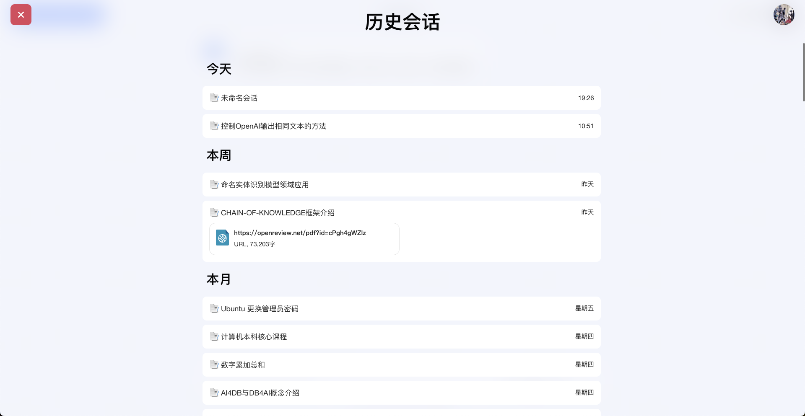
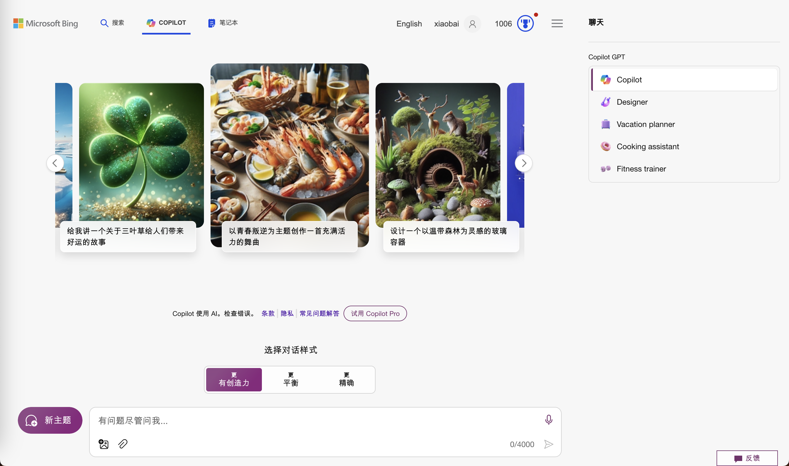
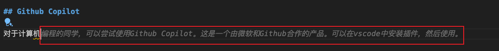
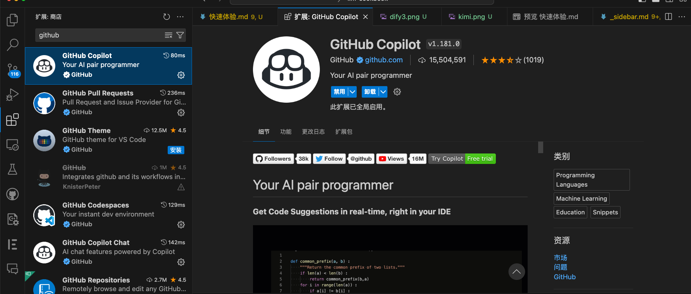

# 快速体验

在这一节课，我们快速介绍目前一些可以快速体验大语言模型的网站和工具，给同学们一个直观的体验。这些网站大多数只需要非常简单的注册，有些甚至完全不需要注册。

## ChatGPT3.5

https://chat.openai.com/

目前chatgpt已经不需要注册就可以直接使用。大家可以打开网址 https://chat.openai.com/。
直接在对话框中输入文字，然后点击send，就可以看到 chatgpt 的回复。这方便大家进行快速体验。

## OpenRouter

https://openrouter.ai/playground

即使不注册，也可以快速体验主要大模型。该网站赠送5美元的代金券。

OpenRouter 使用双币信用卡或者加密货币付费，就可以使用目前市面上最好的两个LLM：GPT4 和 Claude3-Opus.

## GPT4 - Vision, Code Interpreter & GPTs

GPT4 仍旧是目前最好用的 LLM，这里举几个使用例子。

- 使用GPTs Diagram快速重新绘图

- 使用Code-Interpreter进行数据整理、分析和绘图

## Kimi

https://kimi.moonshot.cn/

这是由一家中国公司开发的聊天机器人。可以在这里体验。其特点是可以输入网址和输入长达几十万字。并且目前(2024/4)完全免费。

## Dify

https://www.dify.ai/

如果你想快速开发一个聊天机器人，可以使用这个网站。它提供了一个简单的界面，可以快速开发一个聊天机器人。既可以在云端部署，也可以本地部署。并且可以快速嵌入其他网站页面。

设计提示词，点击发布-运行后，一个在云端托管的服务原型就完成了。

同学们可以在这里进行快速体验。

https://udify.app/chat/9OXFttWZF6foAMlG

## Bing Copilot

https://www.bing.com/

选择上部Copilot标签，可以快速体验微软Bing+OPENAI GPT4的合作产品 bing copilot。

Bing-Copilot 有三种模型，更有创造力，平衡，精确。通常情况下，更有创造力的模型会给出更多的创意性的回答，可以给出更多的参考。但可能犯得错误也会更多。

另外，如果输入中文问题，它会优先使用知乎等的中文知识。如果输入英文问题，它会优先使用英文知识。

## Github Copilot

对于计算机编程的同学，可以尝试使用Github Copilot。这是一个由微软和Github合作的产品。可以在vscode中安装插件，然后使用。

在vscode市场中搜索copilot，安装即可。

如果参与star数大于5000的项目，或者是学生，Github Copilot可以免费使用。

    LLM 领域目前发展非常迅速，同学们可以尝试使用这些工具，体验一下 LLM 的强大功能。