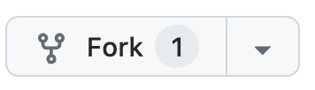

# 环境配置

## Github

1. 用浏览器登录Github，并访问下面的课程地址：

    https://github.com/whitewum/llm-cookbook

2. 点击右上角Fork，建立自己的项目。然后点击Create Fork。



3. 然后在自己的项目中选择Code->Codespaces，建立一个远端的免费服务。


4. 选择'Open in Browser'之后进入该服务，可以看到的界面如下大约如下：


    课程上的主要代码都在这里。

参考如下操作：


5. 课程结束之后，可以结束该服务，然后删除该服务。


## 获取并配置OpenAI API key

将`.env-back`文件复制为同目录下的 `.env`

    在课堂上会生成一个试用的 OPENAI API key，并且在课程结束后会失效。

请将该key保存到`.env`文件中，

```
OPENAI_API_KEY="xxx"
```  

然后打开 `content/setup.ipynb` 文件。