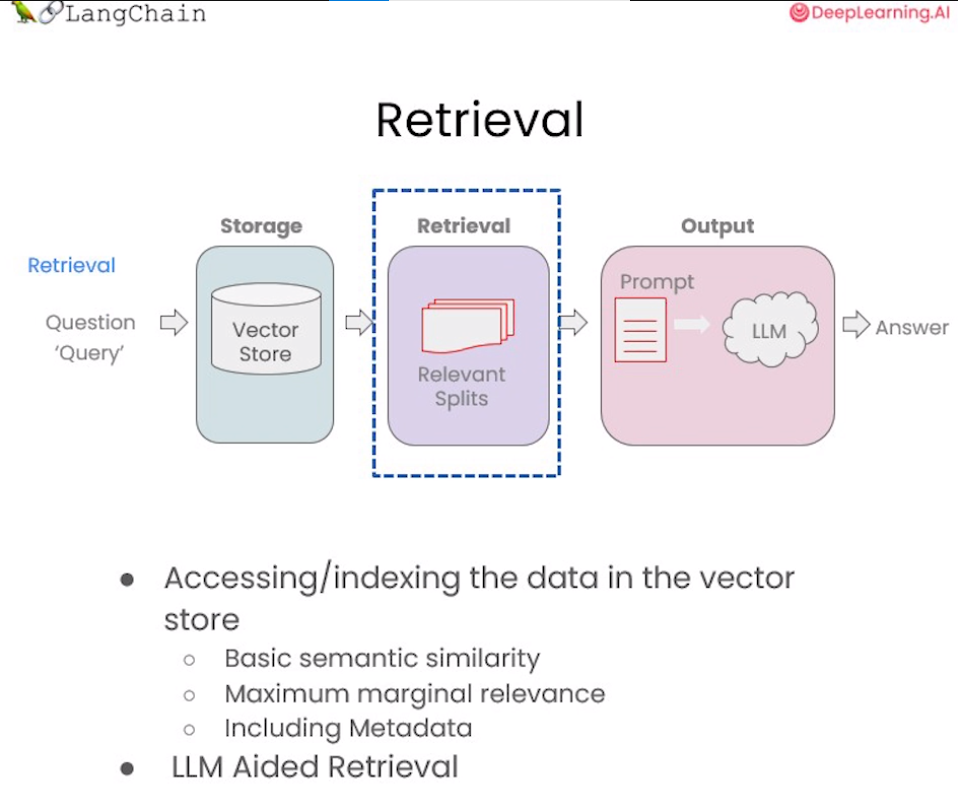
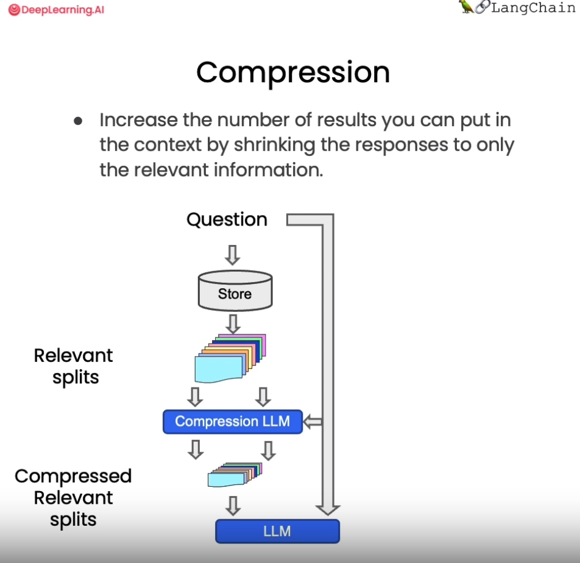

# 第五章 检索(Retrieval)

在构建检索增强生成 (RAG) 系统时，信息检索是核心环节。检索模块负责对用户查询进行分析，从知识库中快速定位相关文档或段落，为后续的语言生成提供信息支持。**检索是指根据用户的问题去向量数据库中搜索与问题相关的文档内容**，当我们访问和查询向量数据库时可能会运用到如下几种技术：

- 基本语义相似度(Basic semantic similarity)
- 最大边际相关性(Maximum marginal relevance，MMR)
- 过滤元数据
- LLM辅助检索



<div align='center'> 图 4.5.1 检索技术 </div>

使用基本的相似性搜索大概能解决你80%的相关检索工作，但对于那些相似性搜索失败的边缘情况该如何解决呢？这一章节我们将介绍几种检索方法，以及解决检索边缘情况的技巧，让我们一起开始学习吧！


## 一、向量数据库检索

本章节需要使用`lark`包，若环境中未安装过此包，请运行以下命令安装：


```python
!pip install -Uq lark
```

### 1.1 相似性检索（Similarity Search）

以我们的流程为例，前面课程已经存储了向量数据库(`VectorDB`)，包含各文档的语义向量表示。首先将上节课所保存的向量数据库(`VectorDB`)加载进来：


```python
from langchain.vectorstores import Chroma
from langchain.embeddings.openai import OpenAIEmbeddings

persist_directory_chinese = 'docs/chroma/matplotlib/'

embedding = OpenAIEmbeddings()

vectordb_chinese = Chroma(
    persist_directory=persist_directory_chinese,
    embedding_function=embedding
)

print(vectordb_chinese._collection.count())
```

    27


下面我们来实现一下语义的相似度搜索，我们把三句话存入向量数据库Chroma中，然后我们提出问题让向量数据库根据问题来搜索相关答案：


```python
texts_chinese = [
    """毒鹅膏菌（Amanita phalloides）具有大型且引人注目的地上（epigeous）子实体（basidiocarp）""",
    """一种具有大型子实体的蘑菇是毒鹅膏菌（Amanita phalloides）。某些品种全白。""",
    """A. phalloides，又名死亡帽，是已知所有蘑菇中最有毒的一种。""",
]
```

我们可以看到前两句都是描述的是一种叫“鹅膏菌”的菌类，包括它们的特征：有较大的子实体，第三句描述的是“鬼笔甲”，一种已知的最毒的蘑菇，它的特征就是：含有剧毒。对于这个例子，我们将创建一个小数据库，我们可以作为一个示例来使用。


```python
smalldb_chinese = Chroma.from_texts(texts_chinese, embedding=embedding)
```

    100%|██████████| 1/1 [00:00<00:00,  1.51it/s]


下面是我们对于这个示例所提出的问题：


```python
question_chinese = "告诉我关于具有大型子实体的全白色蘑菇的信息"
```

现在，让针对上面问题进行**相似性搜索**，设置 k=2 ，只返回两个最相关的文档。


```python
smalldb_chinese.similarity_search(question_chinese, k=2)
```


    [Document(page_content='一种具有大型子实体的蘑菇是毒鹅膏菌（Amanita phalloides）。某些品种全白。', metadata={}),
     Document(page_content='毒鹅膏菌（Amanita phalloides）具有大型且引人注目的地上（epigeous）子实体（basidiocarp）', metadata={})]


我们现在可以看到，向量数据库返回了 2 个文档，就是我们存入向量数据库中的第一句和第二句。这里我们很明显的就可以看到 chroma 的 similarity_search（相似性搜索） 方法可以根据问题的语义去数据库中搜索与之相关性最高的文档，也就是搜索到了第一句和第二句的文本。但这似乎还存在一些问题，因为第一句和第二句的含义非常接近，他们都是描述“鹅膏菌”及其“子实体”的，所以假如只返回其中的一句就足以满足要求了，如果返回两句含义非常接近的文本感觉是一种资源的浪费。下面我们来看一下 max_marginal_relevance_search 的搜索结果。

### 1.2 解决多样性：最大边际相关性(MMR)

最大边际相关模型 (MMR，Maximal Marginal Relevance) 是实现多样性检索的常用算法。


<div align='center'> 图 4.5.2 MMR </div>

**MMR 的基本思想是同时考量查询与文档的相关度，以及文档之间的相似度**。相关度确保返回结果对查询高度相关，相似度则鼓励不同语义的文档被包含进结果集。具体来说，它计算每个候选文档与查询的相关度，并减去与已经选入结果集的文档的相似度。这样更不相似的文档会有更高的得分。

总之，MMR 是解决检索冗余问题、提供多样性结果的一种简单高效的算法。它平衡了相关性和多样性，适用于对多样信息需求较强的应用场景。


我们来看一个利用 MMR 从蘑菇知识库中检索信息的示例。首先加载有关蘑菇的文档，然后运行 MMR 算法，设置 fetch_k 参数，用来告诉向量数据库我们最终需要 k 个结果返回。fetch_k=3 ，也就是我们最初获取 3 个文档，k=2 表示返回最不同的 2 个文档。


```python
smalldb_chinese.max_marginal_relevance_search(question_chinese,k=2, fetch_k=3)
```


    [Document(page_content='一种具有大型子实体的蘑菇是毒鹅膏菌（Amanita phalloides）。某些品种全白。', metadata={}),
     Document(page_content='A. phalloides，又名死亡帽，是已知所有蘑菇中最有毒的一种。', metadata={})]


这里我们看到 max_marginal_relevance_search（最大边际相关搜索） 返回了第二和第三句的文本，尽管第三句与我们的问题的相关性不太高，但是这样的结果其实应该是更加的合理，因为第一句和第二句文本本来就有着相似的含义，所以只需要返回其中的一句就可以了，另外再返回一个与问题相关性弱一点的答案(第三句文本)，这样似乎增强了答案的多样性，相信用户也会更加偏爱

还记得在上一节中我们介绍了两种向量数据在查询时的失败场景吗？当向量数据库中存在相同的文档时，而用户的问题又与这些重复的文档高度相关时，向量数据库会出现返回重复文档的情况。现在我们就可以运用Langchain的   max_marginal_relevance_search 来解决这个问题：

我们首先看看前两个文档，只看前几个字符，可以看到它们是相同的。


```python
question_chinese = "Matplotlib是什么？"
docs_ss_chinese = vectordb_chinese.similarity_search(question_chinese,k=3)

print("docs[0]: ")
print(docs_ss_chinese[0].page_content[:100])
print()
print("docs[1]: ")
print(docs_ss_chinese[1].page_content[:100])
```

    docs[0]: 
    第⼀回：Matplotlib 初相识
    ⼀、认识matplotlib
    Matplotlib 是⼀个 Python 2D 绘图库，能够以多种硬拷⻉格式和跨平台的交互式环境⽣成出版物质量的图形，⽤来绘制各种
    
    docs[1]: 
    第⼀回：Matplotlib 初相识
    ⼀、认识matplotlib
    Matplotlib 是⼀个 Python 2D 绘图库，能够以多种硬拷⻉格式和跨平台的交互式环境⽣成出版物质量的图形，⽤来绘制各种


这里如果我们使用相似查询，会得到两个重复的结果，读者可以自己尝试一下，这里不再展示。我们可以使用 `MMR` 得到不一样的结果。


```python
docs_mmr_chinese = vectordb_chinese.max_marginal_relevance_search(question_chinese,k=3)
```

当我们运行 MMR 后得到结果时，我们可以看到第一个与之前的相同，因为那是最相似的。


```python
print(docs_mmr_chinese[0].page_content[:100])
```

    第⼀回：Matplotlib 初相识
    ⼀、认识matplotlib
    Matplotlib 是⼀个 Python 2D 绘图库，能够以多种硬拷⻉格式和跨平台的交互式环境⽣成出版物质量的图形，⽤来绘制各种


但是当我们进行到第二个时，我们可以看到它是不同的。

它在回应中获得了一些多样性。


```python
print(docs_mmr_chinese[1].page_content[:100])
```

    By Datawhale 数据可视化开源⼩组
    © Copyright © Copyright 2021.y轴分为左右两个，因此 tick1 对应左侧的轴； tick2 对应右侧的轴。
    x轴分为上下两个


从以上结果中可以看到，向量数据库返回了 2 篇完全不同的文档，这是因为我们使用的是 MMR 搜索，它把搜索结果中相似度很高的文档做了过滤，所以它保留了结果的相关性又同时兼顾了结果的多样性。

### 1.3 解决特殊性：使用元数据

在上一节课中，关于失败的应用场景我们还提出了一个问题，是询问了关于文档中某一讲的问题，但得到的结果中也包括了来自其他讲的结果。这是我们所不希望看到的结果，之所以产生这样的结果是因为当我们向向量数据库提出问题时，数据库并没有很好的理解问题的语义，所以返回的结果不如预期。要解决这个问题，我们可以通过过滤元数据的方式来实现精准搜索，当前很多向量数据库都支持对`元数据（metadata）`的操作：

`metadata`为每个嵌入的块(embedded chunk)提供上下文。


```python
question_chinese = "他们在第二讲中对Figure说了些什么？"  
```

现在，我们以手动的方式来解决这个问题，我们会指定一个元数据过滤器`filter`


```python
docs_chinese = vectordb_chinese.similarity_search(
    question_chinese,
    k=3,
    filter={"source":"docs/matplotlib/第二回：艺术画笔见乾坤.pdf"}
)
```

接下来，我们可以看到结果都来自对应的章节


```python
for d in docs_chinese:
    print(d.metadata)
    
```

    {'source': 'docs/matplotlib/第二回：艺术画笔见乾坤.pdf', 'page': 9}
    {'source': 'docs/matplotlib/第二回：艺术画笔见乾坤.pdf', 'page': 10}
    {'source': 'docs/matplotlib/第二回：艺术画笔见乾坤.pdf', 'page': 0}


当然，我们不能每次都采用手动的方式来解决这个问题，这会显得不够智能。下一小节中，我们将展示通过LLM来解决这个问题。

### 1.4 解决特殊性：在元数据中使用自查询检索器（LLM辅助检索）

在上例中，我们手动设置了过滤参数 filter 来过滤指定文档。但这种方式不够智能，需要人工指定过滤条件。如何自动从用户问题中提取过滤信息呢？

LangChain提供了SelfQueryRetriever模块，它可以通过语言模型从问题语句中分析出:

1) 向量搜索的查询字符串(search term)

2) 过滤文档的元数据条件(Filter)

以“除了维基百科,还有哪些健康网站”为例,SelfQueryRetriever可以推断出“除了维基百科”表示需要过滤的条件,即排除维基百科的文档。

它使用语言模型自动解析语句语义,提取过滤信息,无需手动设置。这种基于理解的元数据过滤更加智能方便,可以自动处理更复杂的过滤逻辑。

掌握利用语言模型实现自动化过滤的技巧,可以大幅降低构建针对性问答系统的难度。这种自抽取查询的方法使检索更加智能和动态。

其原理如下图所示：


<div align='center'> 图 4.5.3 自抽取查询 </div>


下面我们就来实现一下LLM辅助检索：


```python
from langchain.llms import OpenAI
from langchain.retrievers.self_query.base import SelfQueryRetriever
from langchain.chains.query_constructor.base import AttributeInfo

llm = OpenAI(temperature=0)
```

这里我们首先定义了 metadata_field_info_chinese ，它包含了元数据的过滤条件 `source` 和 `page` , 其中 source 的作用是告诉 LLM 我们想要的数据来自于哪里， page 告诉 LLM 我们需要提取相关的内容在原始文档的哪一页。有了 metadata_field_info_chinese 信息后，LLM会自动从用户的问题中提取出上图中的 Filter 和 Search term 两项，然后向量数据库基于这两项去搜索相关的内容。下面我们看一下查询结果：


```python
metadata_field_info_chinese = [
    AttributeInfo(
        name="source",
        description="The lecture the chunk is from, should be one of `docs/matplotlib/第一回：Matplotlib初相识.pdf`, `docs/matplotlib/第二回：艺术画笔见乾坤.pdf`, or `docs/matplotlib/第三回：布局格式定方圆.pdf`",
        type="string",
    ),
    AttributeInfo(
        name="page",
        description="The page from the lecture",
        type="integer",
    ),
]

document_content_description_chinese = "Matplotlib 课堂讲义"
retriever_chinese = SelfQueryRetriever.from_llm(
    llm,
    vectordb_chinese,
    document_content_description_chinese,
    metadata_field_info_chinese,
    verbose=True
)

question_chinese = "他们在第二讲中对Figure做了些什么？"  
```

当你第一次执行下一行时，你会收到关于predict_and_parse已被弃用的**警告**。 这可以安全地忽略。


```python
docs_chinese = retriever_chinese.get_relevant_documents(question_chinese)
```

    /root/autodl-tmp/env/gpt/lib/python3.10/site-packages/langchain/chains/llm.py:275: UserWarning: The predict_and_parse method is deprecated, instead pass an output parser directly to LLMChain.
      warnings.warn(


    query='Figure' filter=Comparison(comparator=<Comparator.EQ: 'eq'>, attribute='source', value='docs/matplotlib/第二回：艺术画笔见乾坤.pdf') limit=None


打印可以看到查询结果，基于子查询检索器，我们检索到的结果都是在第二回的文档中：


```python
for d in docs_chinese:
    print(d.metadata)
```

    {'source': 'docs/matplotlib/第二回：艺术画笔见乾坤.pdf', 'page': 9}
    {'source': 'docs/matplotlib/第二回：艺术画笔见乾坤.pdf', 'page': 10}
    {'source': 'docs/matplotlib/第二回：艺术画笔见乾坤.pdf', 'page': 0}
    {'source': 'docs/matplotlib/第二回：艺术画笔见乾坤.pdf', 'page': 6}


### 1.5 其他技巧：压缩

在使用向量检索获取相关文档时，直接返回整个文档片段可能带来资源浪费，因为实际相关的只是文档的一小部分。为改进这一点，LangChain提供了一种“`压缩`”检索机制。其工作原理是，**先使用标准向量检索获得候选文档，然后基于查询语句的语义，使用语言模型压缩这些文档,只保留与问题相关的部分**。例如，对“蘑菇的营养价值”这个查询，检索可能返回整篇有关蘑菇的长文档。经压缩后，只提取文档中与“营养价值”相关的句子。



<div align='center'> 图 4.5.4 压缩 </div>

从上图中我们看到，当向量数据库返回了所有与问题相关的所有文档块的全部内容后，会有一个Compression LLM来负责对这些返回的文档块的内容进行压缩，所谓压缩是指仅从文档块中提取出和用户问题相关的内容，并舍弃掉那些不相关的内容。


```python
from langchain.retrievers import ContextualCompressionRetriever
from langchain.retrievers.document_compressors import LLMChainExtractor

def pretty_print_docs(docs):
    print(f"\n{'-' * 100}\n".join([f"Document {i+1}:\n\n" + d.page_content for i, d in enumerate(docs)]))

llm = OpenAI(temperature=0)
compressor = LLMChainExtractor.from_llm(llm)  # 压缩器

compression_retriever_chinese = ContextualCompressionRetriever(
    base_compressor=compressor,
    base_retriever=vectordb_chinese.as_retriever()
)
# 对源文档进行压缩

question_chinese = "Matplotlib是什么？"
compressed_docs_chinese = compression_retriever_chinese.get_relevant_documents(question_chinese)
pretty_print_docs(compressed_docs_chinese)
```

    Document 1:
    
    Matplotlib 是⼀个 Python 2D 绘图库，能够以多种硬拷⻉格式和跨平台的交互式环境⽣成出版物质量的图形，⽤来绘制各种静态，动态，交互式的图表。
    ----------------------------------------------------------------------------------------------------
    Document 2:
    
    Matplotlib 是⼀个 Python 2D 绘图库，能够以多种硬拷⻉格式和跨平台的交互式环境⽣成出版物质量的图形，⽤来绘制各种静态，动态，交互式的图表。


在上面的代码中我们定义了一个 LLMChainExtractor ，它是一个压缩器，它负责从向量数据库返回的文档块中提取相关信息，然后我们还定义了 ContextualCompressionRetriever ，它有两个参数：base_compressor 和 base_retriever，其中 base_compressor 是我们前面定义的 LLMChainExtractor 的实例，base_retriever是早前定义的 vectordb 产生的检索器。

现在当我们提出问题后，查看结果文档，我们可以看到两件事。

1. 它们比正常文档短很多
2. 仍然有一些重复的东西，这是因为在底层我们使用的是语义搜索算法。

从上述例子中，我们可以发现这种压缩可以有效提升输出质量，同时节省通过长文档带来的计算资源浪费，降低成本。上下文相关的压缩检索技术，使得到的支持文档更严格匹配问题需求，是提升问答系统效率的重要手段。读者可以在实际应用中考虑这一技术。

## 二、结合各种技术

为了去掉结果中的重复文档，我们在从向量数据库创建检索器时，可以将搜索类型设置为 MMR 。然后我们可以重新运行这个过程，可以看到我们返回的是一个过滤过的结果集，其中不包含任何重复的信息。


```python
compression_retriever_chinese = ContextualCompressionRetriever(
    base_compressor=compressor,
    base_retriever=vectordb_chinese.as_retriever(search_type = "mmr")
)

question_chinese = "Matplotlib是什么？"
compressed_docs_chinese = compression_retriever_chinese.get_relevant_documents(question_chinese)
pretty_print_docs(compressed_docs_chinese)
```

    Document 1:
    
    Matplotlib 是⼀个 Python 2D 绘图库，能够以多种硬拷⻉格式和跨平台的交互式环境⽣成出版物质量的图形，⽤来绘制各种静态，动态，交互式的图表。


## 三、其他类型的检索

值得注意的是，vetordb 并不是唯一一种检索文档的工具。`LangChain` 还提供了其他检索文档的方式，例如：`TF-IDF` 或 `SVM`。


```python
from langchain.retrievers import SVMRetriever
from langchain.retrievers import TFIDFRetriever
from langchain.document_loaders import PyPDFLoader
from langchain.text_splitter import RecursiveCharacterTextSplitter

# 加载PDF
loader_chinese = PyPDFLoader("docs/matplotlib/第一回：Matplotlib初相识.pdf")
pages_chinese = loader_chinese.load()
all_page_text_chinese = [p.page_content for p in pages_chinese]
joined_page_text_chinese = " ".join(all_page_text_chinese)

# 分割文本
text_splitter_chinese = RecursiveCharacterTextSplitter(chunk_size = 1500,chunk_overlap = 150)
splits_chinese = text_splitter_chinese.split_text(joined_page_text_chinese)

# 检索
svm_retriever = SVMRetriever.from_texts(splits_chinese, embedding)
tfidf_retriever = TFIDFRetriever.from_texts(splits_chinese)
```

这里我们定义了 SVMRetriever ，和 TFIDFRetriever 两个检索器，接下来我们分别测试 TF-IDF 检索以及 SVM 检索的效果：


```python
question_chinese = "这门课的主要主题是什么？" 
docs_svm_chinese = svm_retriever.get_relevant_documents(question_chinese)
print(docs_svm_chinese[0])
```

    page_content='fig, ax = plt.subplots()  \n# step4 绘制图像，  这⼀模块的扩展参考第⼆章进⼀步学习\nax.plot(x, y, label=\'linear\')  \n# step5 添加标签，⽂字和图例，这⼀模块的扩展参考第四章进⼀步学习\nax.set_xlabel(\'x label\') \nax.set_ylabel(\'y label\') \nax.set_title("Simple Plot")  \nax.legend() ;\n思考题\n请思考两种绘图模式的优缺点和各⾃适合的使⽤场景\n在第五节绘图模板中我们是以 OO 模式作为例⼦展示的，请思考并写⼀个 pyplot 绘图模式的简单模板' metadata={}


可以看出，SVM 检索的效果要差于 VectorDB。


```python
question_chinese = "Matplotlib是什么？"
docs_tfidf_chinese = tfidf_retriever.get_relevant_documents(question_chinese)
print(docs_tfidf_chinese[0])
```

    page_content='fig, ax = plt.subplots()  \n# step4 绘制图像，  这⼀模块的扩展参考第⼆章进⼀步学习\nax.plot(x, y, label=\'linear\')  \n# step5 添加标签，⽂字和图例，这⼀模块的扩展参考第四章进⼀步学习\nax.set_xlabel(\'x label\') \nax.set_ylabel(\'y label\') \nax.set_title("Simple Plot")  \nax.legend() ;\n思考题\n请思考两种绘图模式的优缺点和各⾃适合的使⽤场景\n在第五节绘图模板中我们是以 OO 模式作为例⼦展示的，请思考并写⼀个 pyplot 绘图模式的简单模板' metadata={}


同样，TF-IDF 检索的效果也不尽如人意。

## 四、总结
今天的课程涵盖了向量检索的多项新技术，让我们快速回顾关键要点：

1) MMR 算法可以实现兼具相关性与多样性的检索结果，避免信息冗余。

2) 定义元数据字段可以进行针对性过滤，提升匹配准确率。

3) SelfQueryRetriever 模块通过语言模型自动分析语句，提取查询字符串与过滤条件，无需手动设置，使检索更智能。

4) ContextualCompressionRetriever 实现压缩检索，仅返回与问题相关的文档片段，可以大幅提升效率并节省计算资源。

5) 除向量检索外，还简要介绍了基于 SVM 和 TF-IDF 的检索方法。

这些技术为我们构建可交互的语义搜索模块提供了重要支持。熟练掌握各检索算法的适用场景，将大大增强问答系统的智能水平。希望本节的教程能够对大家有所帮助!


## 五、英文版

**1.1 相似性检索**


```python
from langchain.vectorstores import Chroma
from langchain.embeddings.openai import OpenAIEmbeddings

persist_directory = 'docs/chroma/cs229_lectures/'

embedding = OpenAIEmbeddings()
vectordb = Chroma(
    persist_directory=persist_directory,
    embedding_function=embedding
)
print(vectordb._collection.count())
```

    209


简单示例


```python
texts = [
    """The Amanita phalloides has a large and imposing epigeous (aboveground) fruiting body (basidiocarp).""",
    """A mushroom with a large fruiting body is the Amanita phalloides. Some varieties are all-white.""",
    """A. phalloides, a.k.a Death Cap, is one of the most poisonous of all known mushrooms.""",
]

smalldb = Chroma.from_texts(texts, embedding=embedding)

question = "Tell me about all-white mushrooms with large fruiting bodies"

print("相似性检索：")
print(smalldb.similarity_search(question, k=2))
print("MMR 检索：")
print(smalldb_chinese.max_marginal_relevance_search(question,k=2, fetch_k=3))
```

      0%|          | 0/1 [00:00<?, ?it/s]100%|██████████| 1/1 [00:00<00:00,  2.55it/s]


    相似性检索：
    [Document(page_content='A mushroom with a large fruiting body is the Amanita phalloides. Some varieties are all-white.', metadata={}), Document(page_content='The Amanita phalloides has a large and imposing epigeous (aboveground) fruiting body (basidiocarp).', metadata={})]
    MMR 检索：
    [Document(page_content='一种具有大型子实体的蘑菇是毒鹅膏菌（Amanita phalloides）。某些品种全白。', metadata={}), Document(page_content='A. phalloides，又名死亡帽，是已知所有蘑菇中最有毒的一种。', metadata={})]


**1.2 最大边际相关性**


```python
question = "what did they say about matlab?"
docs_ss = vectordb.similarity_search(question,k=3)

print("相似性检索：")
print("docs[0]: ")
print(docs_ss[0].page_content[:100])
print()
print("docs[1]: ")
print(docs_ss[1].page_content[:100])
print()

docs_mmr = vectordb.max_marginal_relevance_search(question,k=3)
print("MMR 检索：")
print("mmr[0]: ")
print(docs_mmr[0].page_content[:100])
print()
print("MMR 检索：")
print("mmr[1]: ")
print(docs_mmr[1].page_content[:100])
```

    相似性检索：
    docs[0]: 
    those homeworks will be done in either MATLA B or in Octave, which is sort of — I 
    know some people 
    
    docs[1]: 
    those homeworks will be done in either MATLA B or in Octave, which is sort of — I 
    know some people 
    
    MMR 检索：
    mmr[0]: 
    those homeworks will be done in either MATLA B or in Octave, which is sort of — I 
    know some people 
    
    MMR 检索：
    mmr[1]: 
    algorithm then? So what’s different? How come  I was making all that noise earlier about 
    least squa


**1.3 使用元数据**


```python
question = "what did they say about regression in the third lecture?"

docs = vectordb.similarity_search(
    question,
    k=3,
    filter={"source":"docs/cs229_lectures/MachineLearning-Lecture03.pdf"}
)

for d in docs:
    print(d.metadata)
```

    {'source': 'docs/cs229_lectures/MachineLearning-Lecture03.pdf', 'page': 0}
    {'source': 'docs/cs229_lectures/MachineLearning-Lecture03.pdf', 'page': 14}
    {'source': 'docs/cs229_lectures/MachineLearning-Lecture03.pdf', 'page': 4}


**1.4 使用自查询检索器**


```python
from langchain.llms import OpenAI
from langchain.retrievers.self_query.base import SelfQueryRetriever
from langchain.chains.query_constructor.base import AttributeInfo

llm = OpenAI(temperature=0)

metadata_field_info = [
    AttributeInfo(
        name="source",
        description="The lecture the chunk is from, should be one of `docs/cs229_lectures/MachineLearning-Lecture01.pdf`, `docs/cs229_lectures/MachineLearning-Lecture02.pdf`, or `docs/cs229_lectures/MachineLearning-Lecture03.pdf`",
        type="string",
    ),
    AttributeInfo(
        name="page",
        description="The page from the lecture",
        type="integer",
    ),
]

document_content_description = "Lecture notes"
retriever = SelfQueryRetriever.from_llm(
    llm,
    vectordb,
    document_content_description,
    metadata_field_info,
    verbose=True
)

question = "what did they say about regression in the third lecture?"

docs = retriever.get_relevant_documents(question)

for d in docs:
    print(d.metadata)
```

    /root/autodl-tmp/env/gpt/lib/python3.10/site-packages/langchain/chains/llm.py:275: UserWarning: The predict_and_parse method is deprecated, instead pass an output parser directly to LLMChain.
      warnings.warn(


    query='regression' filter=Comparison(comparator=<Comparator.EQ: 'eq'>, attribute='source', value='docs/cs229_lectures/MachineLearning-Lecture03.pdf') limit=None
    {'source': 'docs/cs229_lectures/MachineLearning-Lecture03.pdf', 'page': 14}
    {'source': 'docs/cs229_lectures/MachineLearning-Lecture03.pdf', 'page': 0}
    {'source': 'docs/cs229_lectures/MachineLearning-Lecture03.pdf', 'page': 10}
    {'source': 'docs/cs229_lectures/MachineLearning-Lecture03.pdf', 'page': 10}


**1.5 压缩**


```python
from langchain.retrievers import ContextualCompressionRetriever
from langchain.retrievers.document_compressors import LLMChainExtractor

def pretty_print_docs(docs):
    print(f"\n{'-' * 100}\n".join([f"Document {i+1}:\n\n" + d.page_content for i, d in enumerate(docs)]))

llm = OpenAI(temperature=0)
compressor = LLMChainExtractor.from_llm(llm)  # 压缩器

compression_retriever = ContextualCompressionRetriever(
    base_compressor=compressor,
    base_retriever=vectordb.as_retriever()
)

question = "what did they say about matlab?"
compressed_docs = compression_retriever.get_relevant_documents(question)
pretty_print_docs(compressed_docs)
```

    Document 1:
    
    "MATLAB is I guess part of the programming language that makes it very easy to write codes using matrices, to write code for numerical routines, to move data around, to plot data. And it's sort of an extremely easy to learn tool to use for implementing a lot of learning algorithms."
    ----------------------------------------------------------------------------------------------------
    Document 2:
    
    "MATLAB is I guess part of the programming language that makes it very easy to write codes using matrices, to write code for numerical routines, to move data around, to plot data. And it's sort of an extremely easy to learn tool to use for implementing a lot of learning algorithms."
    ----------------------------------------------------------------------------------------------------
    Document 3:
    
    "And the student said, "Oh, it was the MATLAB." So for those of you that don't know MATLAB yet, I hope you do learn it. It's not hard, and we'll actually have a short MATLAB tutorial in one of the discussion sections for those of you that don't know it."
    ----------------------------------------------------------------------------------------------------
    Document 4:
    
    "And the student said, "Oh, it was the MATLAB." So for those of you that don't know MATLAB yet, I hope you do learn it. It's not hard, and we'll actually have a short MATLAB tutorial in one of the discussion sections for those of you that don't know it."


**2.1 结合各种技术**


```python
compression_retriever = ContextualCompressionRetriever(
    base_compressor=compressor,
    base_retriever=vectordb.as_retriever(search_type = "mmr")
)

question = "what did they say about matlab?"
compressed_docs = compression_retriever.get_relevant_documents(question)
pretty_print_docs(compressed_docs)
```

    Document 1:
    
    "MATLAB is I guess part of the programming language that makes it very easy to write codes using matrices, to write code for numerical routines, to move data around, to plot data. And it's sort of an extremely easy to learn tool to use for implementing a lot of learning algorithms."
    ----------------------------------------------------------------------------------------------------
    Document 2:
    
    "And the student said, "Oh, it was the MATLAB." So for those of you that don't know MATLAB yet, I hope you do learn it. It's not hard, and we'll actually have a short MATLAB tutorial in one of the discussion sections for those of you that don't know it."


**3.1 其他类型的检索**


```python
from langchain.retrievers import SVMRetriever
from langchain.retrievers import TFIDFRetriever
from langchain.document_loaders import PyPDFLoader
from langchain.text_splitter import RecursiveCharacterTextSplitter

# 加载PDF
loader = PyPDFLoader("docs/cs229_lectures/MachineLearning-Lecture01.pdf")
pages = loader.load()
all_page_text = [p.page_content for p in pages]
joined_page_text = " ".join(all_page_text)

# 分割文本
text_splitter = RecursiveCharacterTextSplitter(chunk_size = 1500,chunk_overlap = 150)
splits = text_splitter.split_text(joined_page_text)

# 检索
svm_retriever = SVMRetriever.from_texts(splits, embedding)
tfidf_retriever = TFIDFRetriever.from_texts(splits)

question = "What are major topics for this class?"  # 这门课的主要主题是什么？
print("SVM:")
docs_svm = svm_retriever.get_relevant_documents(question)
print(docs_svm[0])

question = "what did they say about matlab?"
print("TF-IDF:")
docs_tfidf = tfidf_retriever.get_relevant_documents(question)
print(docs_tfidf[0])


```

    SVM:
    page_content="let me just check what questions you have righ t now. So if there are no questions, I'll just \nclose with two reminders, which are after class today or as you start to talk with other \npeople in this class, I just encourage you again to start to form project partners, to try to \nfind project partners to do your project with. And also, this is a good time to start forming \nstudy groups, so either talk to your friends  or post in the newsgroup, but we just \nencourage you to try to star t to do both of those today, okay? Form study groups, and try \nto find two other project partners.  \nSo thank you. I'm looking forward to teaching this class, and I'll see you in a couple of \ndays.   [End of Audio]  \nDuration: 69 minutes" metadata={}
    TF-IDF:
    page_content="Saxena and Min Sun here did, wh ich is given an image like this, right? This is actually a \npicture taken of the Stanford campus. You can apply that sort of cl ustering algorithm and \ngroup the picture into regions. Let me actually blow that up so that you can see it more \nclearly. Okay. So in the middle, you see the lines sort of groupi ng the image together, \ngrouping the image into [inaudible] regions.  \nAnd what Ashutosh and Min did was they then  applied the learning algorithm to say can \nwe take this clustering and us e it to build a 3D model of the world? And so using the \nclustering, they then had a lear ning algorithm try to learn what the 3D structure of the \nworld looks like so that they could come up with a 3D model that you can sort of fly \nthrough, okay? Although many people used to th ink it's not possible to take a single \nimage and build a 3D model, but using a lear ning algorithm and that sort of clustering \nalgorithm is the first step. They were able to.  \nI'll just show you one more example. I like this  because it's a picture of Stanford with our \nbeautiful Stanford campus. So again, taking th e same sort of clustering algorithms, taking \nthe same sort of unsupervised learning algor ithm, you can group the pixels into different \nregions. And using that as a pre-processing step, they eventually built this sort of 3D model of Stanford campus in a single picture.  You can sort of walk  into the ceiling, look" metadata={}

