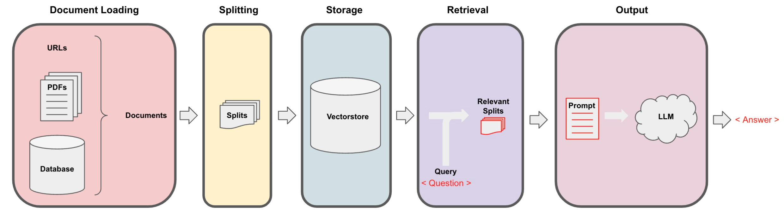

# 第六章 问答


Langchain 在实现与外部数据对话的功能时需要经历下面的5个阶段，它们分别是：Document Loading->Splitting->Storage->Retrieval->Output，如下图所示：



<div align='center'> 图 4.6.1 访问个人数据全流程 </div>


我们已经完成了整个存储和获取，获取了相关的切分文档之后，现在我们需要将它们传递给语言模型，以获得答案。这个过程的一般流程如下：首先问题被提出，然后我们查找相关的文档，接着将这些切分文档和系统提示一起传递给语言模型，并获得答案。

默认情况下，我们将所有的文档切片都传递到同一个上下文窗口中，即同一次语言模型调用中。然而，有一些不同的方法可以解决这个问题，它们都有优缺点。大部分优点来自于有时可能会有很多文档，但你简单地无法将它们全部传递到同一个上下文窗口中。MapReduce、Refine 和 MapRerank 是三种方法，用于解决这个短上下文窗口的问题。我们将在该课程中进行简要介绍。

在上一章，我们已经讨论了如何检索与给定问题相关的文档。下一步是获取这些文档，拿到原始问题，将它们一起传递给语言模型，并要求它回答这个问题。在本节中，我们将详细介绍这一过程，以及完成这项任务的几种不同方法。

在2023年9月2日之后，GPT-3.5 API 会进行更新，因此此处需要进行一个时间判断


```python
import datetime
current_date = datetime.datetime.now().date()
if current_date < datetime.date(2023, 9, 2):
    llm_name = "gpt-3.5-turbo-0301"
else:
    llm_name = "gpt-3.5-turbo"
print(llm_name)
```

    gpt-3.5-turbo-0301


## 一、加载向量数据库

首先我们加载之前已经进行持久化的向量数据库：


```python
from langchain.vectorstores import Chroma
from langchain.embeddings.openai import OpenAIEmbeddings
persist_directory = 'docs/chroma/matplotlib/'
embedding = OpenAIEmbeddings()
vectordb = Chroma(persist_directory=persist_directory, embedding_function=embedding)

print(vectordb._collection.count())
```

    27


我们可以测试一下对于一个提问进行向量检索。如下代码会在向量数据库中根据相似性进行检索，返回给你 k 个文档。


```python
question = "这节课的主要话题是什么"
docs = vectordb.similarity_search(question,k=3)
len(docs)
```
    3


## 二、构造检索式问答链

基于 LangChain，我们可以构造一个使用 GPT3.5 进行问答的检索式问答链，这是一种通过检索步骤进行问答的方法。我们可以通过传入一个语言模型和一个向量数据库来创建它作为检索器。然后，我们可以用问题作为查询调用它，得到一个答案。


<div align='center'> 图 4.6.2 检索式问答链 </div>


```python
# 使用 ChatGPT3.5，温度设置为0
from langchain.chat_models import ChatOpenAI
# 导入检索式问答链
from langchain.chains import RetrievalQA

llm = ChatOpenAI(model_name=llm_name, temperature=0)

# 声明一个检索式问答链
qa_chain = RetrievalQA.from_chain_type(
    llm,
    retriever=vectordb.as_retriever()
)

# 可以以该方式进行检索问答
question = "这节课的主要话题是什么"
result = qa_chain({"query": question})

print(result["result"])
```

    这节课的主要话题是介绍 Matplotlib，一个 Python 2D 绘图库，能够以多种硬拷贝格式和跨平台的交互式环境生成出版物质量的图形，用来绘制各种静态，动态，交互式的图表。同时，也介绍了 Matplotlib 的基本概念和最简单的绘图例子，以及 Figure 的组成和 Axis 的属性。


## 三、深入探究检索式问答链

在获取与问题相关的文档后，我们需要将文档和原始问题一起输入语言模型，生成回答。默认是合并所有文档，一次性输入模型。但**存在上下文长度限制的问题**，若相关文档量大，难以一次将全部输入模型。针对这一问题，本章将介绍 MapReduce 、Refine 和 MapRerank 三种策略。

- MapReduce 通过多轮检索与问答实现长文档处理
- Refine 让模型主动请求信息
- MapRerank 则通过问答质量调整文档顺序。


<div align='center'> 图 4.6.3 三种其他策略 </div>


三种策略各有优劣 MapReduce 分批处理长文档，Refine 实现可交互问答，MapRerank 优化信息顺序，掌握这些技巧，可以应对语言模型的上下文限制，解决长文档问答困难，提升问答覆盖面。

通过上述代码，我们可以实现一个简单的检索式问答链。接下来，让我们深入其中的细节，看看在这个检索式问答链中，LangChain 都做了些什么。

### 3.1 基于模板的检索式问答链

我们首先定义了一个提示模板。它包含一些关于如何使用下面的上下文片段的说明，然后有一个上下文变量的占位符。


```python
# 中文版
from langchain.prompts import PromptTemplate

# Build prompt
template = """使用以下上下文片段来回答最后的问题。如果你不知道答案，只需说不知道，不要试图编造答案。答案最多使用三个句子。尽量简明扼要地回答。在回答的最后一定要说"感谢您的提问！"
{context}
问题：{question}
有用的回答："""
QA_CHAIN_PROMPT = PromptTemplate.from_template(template)
```

接着我们基于该模板来构建检索式问答链：


```python
# Run chain
qa_chain = RetrievalQA.from_chain_type(
    llm,
    retriever=vectordb.as_retriever(),
    return_source_documents=True,
    chain_type_kwargs={"prompt": QA_CHAIN_PROMPT}
)
```

构建出的检索式问答链使用方法同上：


```python
question = "这门课会学习 Python 吗"
result = qa_chain({"query": question})
print(result["result"])
```

    根据上下文，这门课程主要是关于 Matplotlib 数据可视化库的使用和基础知识的介绍，Python 是使用 Matplotlib 的编程语言，因此在学习过程中会涉及到 Python 的使用。但是这门课程的重点是 Matplotlib，而不是 Python 语言本身。感谢您的提问！


可以查看其检索到的源文档：


```python
print(result["source_documents"][0])
```

    page_content='第⼀回：Matplotlib 初相识\n⼀、认识matplotlib\nMatplotlib 是⼀个 Python 2D 绘图库，能够以多种硬拷⻉格式和跨平台的交互式环境⽣成出版物质量的图形，⽤来绘制各种静态，动态，\n交互式的图表。\nMatplotlib 可⽤于 Python 脚本， Python 和 IPython Shell 、 Jupyter notebook ， Web 应⽤程序服务器和各种图形⽤户界⾯⼯具包等。\nMatplotlib 是 Python 数据可视化库中的泰⽃，它已经成为 python 中公认的数据可视化⼯具，我们所熟知的 pandas 和 seaborn 的绘图接⼝\n其实也是基于 matplotlib 所作的⾼级封装。\n为了对matplotlib 有更好的理解，让我们从⼀些最基本的概念开始认识它，再逐渐过渡到⼀些⾼级技巧中。\n⼆、⼀个最简单的绘图例⼦\nMatplotlib 的图像是画在 figure （如 windows ， jupyter 窗体）上的，每⼀个 figure ⼜包含了⼀个或多个 axes （⼀个可以指定坐标系的⼦区\n域）。最简单的创建 figure 以及 axes 的⽅式是通过 pyplot.subplots命令，创建 axes 以后，可以使⽤ Axes.plot绘制最简易的折线图。\nimport matplotlib.pyplot as plt\nimport matplotlib as mpl\nimport numpy as np\nfig, ax = plt.subplots()  # 创建⼀个包含⼀个 axes 的 figure\nax.plot([1, 2, 3, 4], [1, 4, 2, 3]);  # 绘制图像\nTrick： 在jupyter notebook 中使⽤ matplotlib 时会发现，代码运⾏后⾃动打印出类似 <matplotlib.lines.Line2D at 0x23155916dc0>\n这样⼀段话，这是因为 matplotlib 的绘图代码默认打印出最后⼀个对象。如果不想显示这句话，有以下三种⽅法，在本章节的代码示例\n中你能找到这三种⽅法的使⽤。\n\x00. 在代码块最后加⼀个分号 ;\n\x00. 在代码块最后加⼀句 plt.show()\n\x00. 在绘图时将绘图对象显式赋值给⼀个变量，如将 plt.plot([1, 2, 3, 4]) 改成 line =plt.plot([1, 2, 3, 4])\n和MATLAB 命令类似，你还可以通过⼀种更简单的⽅式绘制图像， matplotlib.pyplot⽅法能够直接在当前 axes 上绘制图像，如果⽤户\n未指定axes ， matplotlib 会帮你⾃动创建⼀个。所以上⾯的例⼦也可以简化为以下这⼀⾏代码。\nline =plt.plot([1, 2, 3, 4], [1, 4, 2, 3]) \n三、Figure 的组成\n现在我们来深⼊看⼀下 figure 的组成。通过⼀张 figure 解剖图，我们可以看到⼀个完整的 matplotlib 图像通常会包括以下四个层级，这些\n层级也被称为容器（ container ），下⼀节会详细介绍。在 matplotlib 的世界中，我们将通过各种命令⽅法来操纵图像中的每⼀个部分，\n从⽽达到数据可视化的最终效果，⼀副完整的图像实际上是各类⼦元素的集合。\nFigure：顶层级，⽤来容纳所有绘图元素' metadata={'source': 'docs/matplotlib/第一回：Matplotlib初相识.pdf', 'page': 0}


这种方法非常好，因为它只涉及对语言模型的一次调用。然而，它也有局限性，即如果文档太多，可能无法将它们全部适配到上下文窗口中。我们可以使用另一种技术来对文档进行问答，即 MapReduce 技术。

### 3.2 基于 MapReduce 的检索式问答链

在 MapReduce 技术中，首先将每个独立的文档单独发送到语言模型以获取原始答案。然后，这些答案通过最终对语言模型的一次调用组合成最终的答案。虽然这样涉及了更多对语言模型的调用，但它的优势在于可以处理任意数量的文档。


```python
qa_chain_mr = RetrievalQA.from_chain_type(
    llm,
    retriever=vectordb.as_retriever(),
    chain_type="map_reduce"
)

question = "这门课会学习 Python 吗"
result = qa_chain_mr({"query": question})

print(result["result"])
```

    无法确定，给出的文本并没有提到这门课是否会学习 Python。


当我们将之前的问题通过这个链进行运行时，我们可以看到这种方法的两个问题。第一，速度要慢得多。第二，结果实际上更差。根据给定文档的这一部分，对这个问题并没有明确的答案。这可能是因为它是基于每个文档单独回答的。因此，如果信息分布在两个文档之间，它并没有在同一上下文中获取到所有的信息。


```python
#import os
#os.environ["LANGCHAIN_TRACING_V2"] = "true"
#os.environ["LANGCHAIN_ENDPOINT"] = "https://api.langchain.plus"
#os.environ["LANGCHAIN_API_KEY"] = "..." # replace dots with your api key
```

我们可导入上述环境变量，然后探寻 MapReduce 文档链的细节。例如，上述演示中，我们实际上涉及了四个单独的对语言模型的调用。在运行完每个文档后，它们会在最终链式中组合在一起，即 Stuffed Documents 链，将所有这些回答合并到最终的调用中。

### 3.3 基于 Refine 的检索式问答链

我们还可以将链式类型设置为 Refine ，这是一种新的链式策略。Refine 文档链类似于 MapReduce ，对于每一个文档，会调用一次 LLM。但改进之处在于，最终输入语言模型的 Prompt 是一个序列，将之前的回复与新文档组合在一起，并请求得到改进后的响应。因此，这是一种类似于 RNN 的概念，增强了上下文信息，从而解决信息分布在不同文档的问题。

例如第一次调用，Prompt 包含问题与文档 A ，语言模型生成初始回答。第二次调用，Prompt 包含第一次回复、文档 B ，请求模型更新回答，以此类推。


```python
qa_chain_mr = RetrievalQA.from_chain_type(
    llm,
    retriever=vectordb.as_retriever(),
    chain_type="refine"
)
question = "这门课会学习 Python 吗"
result = qa_chain_mr({"query": question})
print(result["result"])
```

    Refined answer:
    
    The course is about learning Matplotlib, a Python 2D plotting library used for creating publication-quality figures in various formats and platforms. Matplotlib can be used in Python scripts, IPython Shell, Jupyter notebook, web application servers, and various graphical user interface toolkits. The course will cover basic concepts of Matplotlib and gradually transition to advanced techniques. The course will also cover the components of a Matplotlib figure, including the Figure, Axes, and various sub-elements. The course will provide a general plotting template that can be used to create various types of plots. The template follows the Object-Oriented (OO) mode of Matplotlib, but the course will also cover the pyplot mode. Therefore, the course will involve learning Python and Matplotlib for data visualization using both OO and pyplot modes.
    
    In terms of the advantages and disadvantages of the two modes, the OO mode is more flexible and powerful, allowing for more customization and control over the plot elements. However, it requires more code and can be more complex for beginners. On the other hand, the pyplot mode is simpler and easier to use, but it may not provide as much flexibility and control as the OO mode. The pyplot mode is more suitable for quick and simple plots, while the OO mode is more suitable for complex and customized plots.
    
    Here is an example of a simple pyplot mode plotting template:
    
    ```
    import matplotlib.pyplot as plt
    import numpy as np
    
    # Step 1: Prepare data
    x = np.linspace(0, 2, 100)
    y = x**2
    
    # Step 2: Plot data
    plt.plot(x, y)
    
    # Step 3: Customize plot
    plt.xlabel('x label')
    plt.ylabel('y label')
    plt.title('Simple Plot')
    
    # Step 4: Show plot
    plt.show()
    ```
    
    This template can be used to create a simple plot with x and y labels and a title. Additional customization can be added using various pyplot functions.


你会注意到，这个结果比 MapReduce 链的结果要好。这是因为使用 Refine 文档链通过累积上下文，使语言模型能渐进地完善答案，而不是孤立处理每个文档。这种策略可以有效解决信息分散带来的语义不完整问题。但是请注意，由于 LangChain 内部的限制，定义为 Refine 的问答链会默认返回英文作为答案。

## 四、实验：状态记录

让我们在这里做一个实验。我们将创建一个 QA 链，使用默认的 stuff 。让我们问一个问题，这门课会学习 Python 吗？它会回答，学习 Python 是这门课程的前提之一。


```python
qa_chain = RetrievalQA.from_chain_type(
    llm,
    retriever=vectordb.as_retriever()
)

question = "这门课会学习 Python 吗？"
result = qa_chain({"query": question})
print(result["result"])
```

    是的，这门课程会涉及到 Python 编程语言的使用，特别是在数据可视化方面。因此，学习 Python 是这门课程的前提之一。


我们将追问，为什么需要这一前提？然后我们得到了一个答案：“这一前提介绍了 Matplotlib 是什么以及它的基本概念，包括 Figure、Axes、Artist 等，这些是 Matplotlib 绘图的基础，了解这些概念可以帮助用户更好地理解 Matplotlib 的使用方法和绘图原理。因此，在学习 Matplotlib 之前，了解这些基本概念是非常必要的。”这与之前问有关 Python 的问题毫不相关。


```python
question = "为什么需要这一前提"
result = qa_chain({"query": question})
result["result"]
```


    '这一前提介绍了Matplotlib是什么以及它的基本概念，包括Figure、Axes、Artist等，这些是Matplotlib绘图的基础，了解这些概念可以帮助用户更好地理解Matplotlib的使用方法和绘图原理。因此，在学习Matplotlib之前，了解这些基本概念是非常必要的。'


基本上，我们使用的链式（chain）没有任何状态的概念。它不记得之前的问题或之前的答案。为了实现这一点，我们需要引入内存，这是我们将在下一节中讨论的内容。

## 五、英文版

**1.1 加载向量数据库**


```python
from langchain.vectorstores import Chroma
from langchain.embeddings.openai import OpenAIEmbeddings
persist_directory = 'docs/chroma/cs229_lectures/'
embedding = OpenAIEmbeddings()
vectordb = Chroma(persist_directory=persist_directory, embedding_function=embedding)

print(vectordb._collection.count())
```

    209


向量检索


```python
question = "What are major topics for this class?"
docs = vectordb.similarity_search(question,k=3)
print(len(docs))
```

    3


**2.1 构造检索式问答链**


```python
# 使用 ChatGPT3.5，温度设置为0
from langchain.chat_models import ChatOpenAI
# 导入检索式问答链
from langchain.chains import RetrievalQA

llm = ChatOpenAI(model_name=llm_name, temperature=0)

# 声明一个检索式问答链
qa_chain = RetrievalQA.from_chain_type(
    llm,
    retriever=vectordb.as_retriever()
)

# 可以以该方式进行检索问答
question = "What are major topics for this class?"
result = qa_chain({"query": question})

print(result["result"])
```

    The context does not provide a clear answer to this question.


**3.1 基于模板的检索式问答链**


```python
from langchain.prompts import PromptTemplate

# Build prompt
template = """Use the following pieces of context to answer the question at the end. If you don't know the answer, just say that you don't know, don't try to make up an answer. Use three sentences maximum. Keep the answer as concise as possible. Always say "thanks for asking!" at the end of the answer. 
{context}
Question: {question}
Helpful Answer:"""
QA_CHAIN_PROMPT = PromptTemplate.from_template(template)

# Run chain
qa_chain = RetrievalQA.from_chain_type(
    llm,
    retriever=vectordb.as_retriever(),
    return_source_documents=True,
    chain_type_kwargs={"prompt": QA_CHAIN_PROMPT}
)

question = "Is probability a class topic?"
result = qa_chain({"query": question})
print("ANswering:")
print(result["result"])
print("Source document: ")
print(result["source_documents"][0])
```

    ANswering:
    Yes, probability is assumed to be a prerequisite for this class. The instructor assumes familiarity with basic probability and statistics, and will go over some of the prerequisites in the discussion sections as a refresher course. Thanks for asking!
    Source document: 
    page_content="of this class will not be very program ming intensive, although we will do some \nprogramming, mostly in either MATLAB or Octa ve. I'll say a bit more about that later.  \nI also assume familiarity with basic proba bility and statistics. So most undergraduate \nstatistics class, like Stat 116 taught here at Stanford, will be more than enough. I'm gonna \nassume all of you know what ra ndom variables are, that all of you know what expectation \nis, what a variance or a random variable is. And in case of some of you, it's been a while \nsince you've seen some of this material. At some of the discussion sections, we'll actually \ngo over some of the prerequisites, sort of as  a refresher course under prerequisite class. \nI'll say a bit more about that later as well.  \nLastly, I also assume familiarity with basi c linear algebra. And again, most undergraduate \nlinear algebra courses are more than enough. So if you've taken courses like Math 51, \n103, Math 113 or CS205 at Stanford, that would be more than enough. Basically, I'm \ngonna assume that all of you know what matrix es and vectors are, that you know how to \nmultiply matrices and vectors and multiply matrix and matrices, that you know what a matrix inverse is. If you know what an eigenvect or of a matrix is, that'd be even better. \nBut if you don't quite know or if you're not qu ite sure, that's fine, too. We'll go over it in \nthe review sections." metadata={'source': 'docs/cs229_lectures/MachineLearning-Lecture01.pdf', 'page': 4}


**3.2 基于 MapReduce 的检索式问答链**


```python
qa_chain_mr = RetrievalQA.from_chain_type(
    llm,
    retriever=vectordb.as_retriever(),
    chain_type="map_reduce"
)

question = "Is probability a class topic?"
result = qa_chain_mr({"query": question})

print(result["result"])
```

    There is no clear answer to this question based on the given portion of the document. The document mentions statistics and algebra as topics that may be covered, but it does not explicitly state whether probability is a class topic.


**3.3 基于 Refine 的检索式问答链**


```python
qa_chain_mr = RetrievalQA.from_chain_type(
    llm,
    retriever=vectordb.as_retriever(),
    chain_type="refine"
)
question = "Is probability a class topic?"
result = qa_chain_mr({"query": question})
print(result["result"])
```

    The topic of probability is assumed to be a prerequisite and not a main topic of the class. The instructor assumes that students are familiar with basic probability and statistics, including random variables, expectation, variance, and basic linear algebra. The class will cover learning algorithms, including a discussion on overfitting and the probabilistic interpretation of linear regression. The instructor will use this probabilistic interpretation to derive the first classification algorithm, which will be discussed in the class. The classification problem involves predicting a discrete value, such as in medical diagnosis or housing sales. The class will not be very programming-intensive, but some programming will be done in MATLAB or Octave. The instructor will provide a refresher course on the prerequisites in some of the discussion sections. Additionally, the discussion sections will be used to cover extensions for the material taught in the main lectures, as machine learning is a vast field with many topics to explore.


**4.1 实验**


```python
qa_chain = RetrievalQA.from_chain_type(
    llm,
    retriever=vectordb.as_retriever()
)

question = "Is probability a class topic?"
result = qa_chain({"query": question})
print("Q: ", question)
print("A: ", result["result"])

question = "why are those prerequesites needed?"
result = qa_chain({"query": question})
print("Q: ", question)
print("A: ", result["result"])
```

    Q:  Is probability a class topic?
    A:  Yes, probability is a topic that will be assumed to be familiar to students in this class. The instructor assumes that students have a basic understanding of probability and statistics, and will go over some of the prerequisites as a refresher course in the discussion sections.
    Q:  why are those prerequesites needed?
    A:  The prerequisites are needed because in this class, the instructor assumes that all students have a basic knowledge of computer science and knowledge of basic computer skills and principles. This includes knowledge of big-O notation and linear algebra, which are important concepts in machine learning. Without this basic knowledge, it may be difficult for students to understand the material covered in the class.

