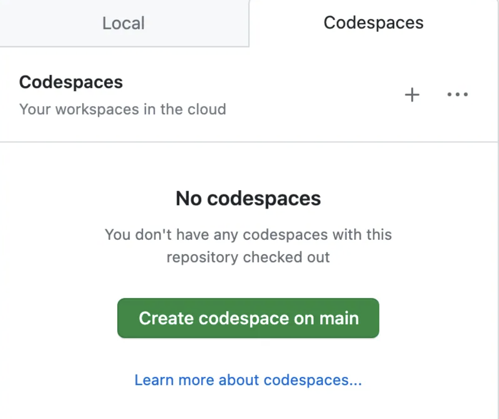

# 环境配置

## Github
<<<<<<< HEAD
=======

用浏览器登录Github，并访问 https://github.com/whitewum/llm-cookbook.

点击右上角Fork，建立自己的项目。  然后点击Create Fork。


然后在自己的项目中选择Code->Codespaces，建立一个远端的免费服务。



之后进入该服务。

本章介绍了阅读本教程所需环境的配置方法，包括 Python、Jupyter Notebook、OpenAI API key、相关库来运⾏本书所需的代码。
>>>>>>> 6c2607ff912d11db7f19f375249b671492e4b4a9

用浏览器登录Github，并访问 https://github.com/whitewum/llm-cookbook.

点击右上角Fork，建立自己的项目。  然后点击Create Fork。


然后在自己的项目中选择Code->Codespaces，建立一个远端的免费服务。


之后进入该服务。大约如下：


## 获取并配置OpenAI API key

将`.env-back`文件复制为同目录下的 `.env`

随课堂会提供一个试用的 OPENAI API key. 

请将该key保存到`.env`文件中，

```
OPENAI_API_KEY="xxx"
```  

然后打开 `content/setup.ipynb` 文件。