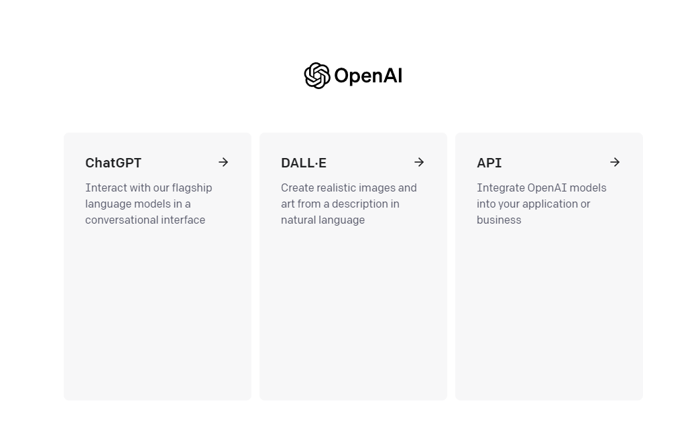

# 环境配置

本章介绍了阅读本教程所需环境的配置方法，包括 Python、Jupyter Notebook、OpenAI API key、相关库来运⾏本书所需的代码。

请注意，以下环境配置有的只需一次配置（如 Python、Jupyter Notebook等），有的需要在每次复现代码时配置（如 OpenAI API key 的配置等）。

## 一、安装Anaconda

由于官网安装较慢，我们可以通过清华源镜像来安装[Anaconda](https://mirrors.tuna.tsinghua.edu.cn/anaconda/archive)

<p align="center">
  
</p>

选择对应的版本下载安装即可。


如果已安装Anaconda，则可以跳过以下步骤。

- 如果我们使用Window系统，可以下载`Anaconda3-2023.07-1-Windows-x86_64.exe`安装包直接安装即可。

- 如果我们使用MacOS系统
    1. Intel芯片：可以下载`Anaconda3-2023.07-1-MacOSX-x86_64.sh`
    2. Apple芯片：可以下载`Anaconda3-2023.07-1-MacOSX-arm64.sh`
    并执行以下操作：


```python
# 以Intel处理器为例，⽂件名可能会更改
sh Anaconda3-2023.07-1-MacOSX-x86_64.sh -b
```

接下来，初始化终端Shell，以便我们可以直接运⾏conda。


```python
~/anaconda3/bin/conda init
```

现在关闭并重新打开当前的shell，我们会发现在命令行的前面多了一个`(base)`,这是anaconda的一个基础`python`环境。下⾯我们使⽤以下命令来创建⼀个新的环境：


```python
# 创建一个名为chatgpt且python版本为3.9的环境
conda create --name chatgpt python=3.9 -y
```

创建完成后，现在我们来激活 chatgpt 环境：


```python
conda activate chatgpt
```

## 二、安装本书需要用到的python库


```python
!pip install -q python-dotenv
!pip install -q openai
## 等更多的python包
```

## 三、获取并配置OpenAI API key

在获取OpenAI API key之前我们需要[openai官网](https://openai.com/)中注册一个账号。这里假设我们已经有了openai账号，先在[openai官网](https://openai.com/)登录，登录后如下图所示：

<p align="center">
  
</p>

我们选择`API`，然后点击右上角的头像，选择`View API keys`，如下图所示：

<p align="center">
  
</p>

点击`Create new secret key`按钮创建OpenAI API key，我们将创建好的OpenAI API key复制以此形式`OPENAI_API_KEY="sk-..."`保存到`.env`文件中，并将`.env`文件保存在项目根目录下。# TODO:放到哪个固定位置待确认

下面是读取`.env`文件的代码


```python
import os
import openai
from dotenv import load_dotenv, find_dotenv

# 读取本地/项目的环境变量。

# find_dotenv()寻找并定位.env文件的路径
# load_dotenv()读取该.env文件，并将其中的环境变量加载到当前的运行环境中  
# 如果你设置的是全局的环境变量，这行代码则没有任何作用。
_ = load_dotenv(find_dotenv())

# 获取环境变量 OPENAI_API_KEY
openai.api_key = os.environ['OPENAI_API_KEY']
```

将读取`.env`文件的代码封装成函数供每一章节直接调用获取在OpenAI API key。


```python
import os
from dotenv import load_dotenv, find_dotenv
def get_openai_key():
    _ = load_dotenv(find_dotenv())
    return os.environ['OPENAI_API_KEY']

openai.api_key = get_openai_key()
```
